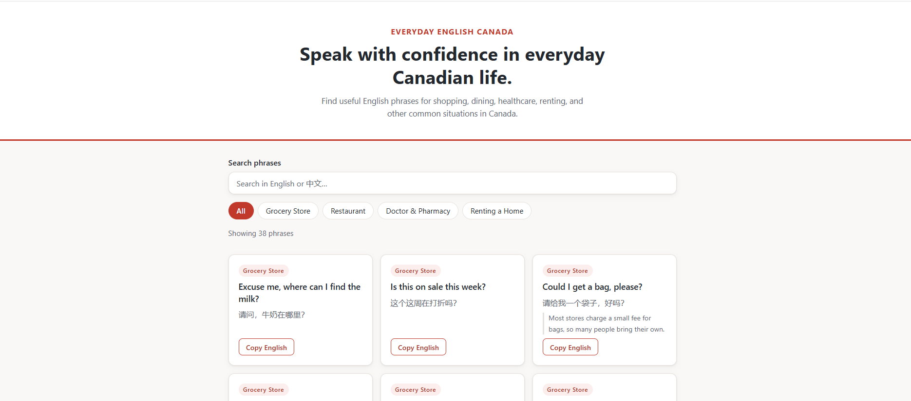

# Everyday English Canada

**Speak with confidence in everyday Canadian life.**

A small phrasebook website that helps newcomers, international students, and
visitors communicate in common everyday situations in Canada. It collects
natural, polite English phrases — with Chinese translations — for grocery
shopping, eating out, visiting a doctor or pharmacy, and renting a home.

## Live Demo

👉 **[everyday-english-canada.vercel.app](https://everyday-english-canada.vercel.app)**

Source code: [github.com/sinanli1994/everyday-english-canada](https://github.com/sinanli1994/everyday-english-canada)

## Screenshot



> Screenshot coming soon — add an image at `docs/screenshot.png` to display it here.

## Features

- 38 practical phrases across 4 categories: Grocery Store, Restaurant,
  Doctor & Pharmacy, and Renting a Home
- English phrases with Chinese translations, plus short notes about
  Canadian customs where helpful
- Category filter buttons
- Live search that matches both English and Chinese text
- One-click **Copy English** button on every phrase card
- Visible count of currently shown phrases
- Friendly empty-state message when nothing matches
- Responsive layout for desktop and mobile
- Accessible: semantic HTML, labelled controls, visible keyboard focus,
  and respect for `prefers-reduced-motion`

## Technologies Used

- HTML
- CSS
- Vanilla JavaScript

No frameworks, build tools, or external dependencies.

## Project Structure

```
everyday-english-canada/
├── index.html   # Page structure and content sections
├── style.css    # All styling, responsive layout, focus styles
├── script.js    # Phrase data, rendering, search, filters, copy button
└── README.md
```

## How to Run Locally

**Option 1 — open the file directly**

1. Clone or download this repository.
2. Double-click `index.html` to open it in your browser.

**Option 2 — VS Code Live Server (auto-reloads on changes)**

1. Open the folder in VS Code.
2. Install the "Live Server" extension.
3. Right-click `index.html` and choose **Open with Live Server**.

## How It Works

- All phrase data lives in a JavaScript array of objects in `script.js`.
- JavaScript renders each phrase card dynamically into the page.
- The search box and category buttons share one filter function, so both
  conditions apply together.
- The Clipboard API copies the English phrase, with a brief "Copied!"
  confirmation and a graceful fallback message if copying fails.

## Deployment

Deployed as a static site on [Vercel](https://vercel.com): the GitHub
repository is imported as a new project with default settings — no build
command needed. Every push to `main` deploys automatically.

## What I Learned

This was my first vibe-coding project, built with Claude Code. Along the way
I practised:

- Defining a clear MVP before writing any code
- Giving structured, specific instructions to Claude Code
- Reviewing and testing AI-generated code instead of trusting it blindly
- Using Git and GitHub for version control
- Deploying a static website with Vercel

## Future Improvements

- More daily-life categories (banking, transit, small talk)
- Pronunciation audio for each phrase
- A favourites list saved in the browser
- Phrase difficulty levels
- French translations
- Offline support

## Author

**Andy Li** — [github.com/sinanli1994](https://github.com/sinanli1994)
